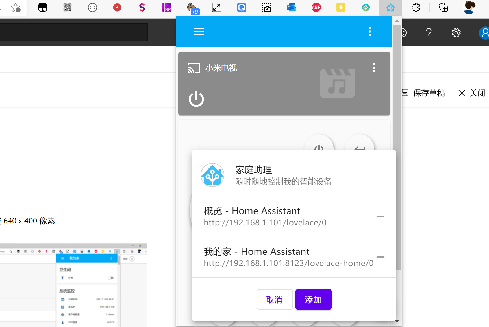

# HomeAssistant浏览器扩展

[![Edge Add-on](https://img.shields.io/badge/Edge扩展-点击安装-%23049cdb?style=for-the-badge&logo=data:image/svg+xml;base64,PD94bWwgdmVyc2lvbj0iMS4wIiBzdGFuZGFsb25lPSJubyI/PjwhRE9DVFlQRSBzdmcgUFVCTElDICItLy9XM0MvL0RURCBTVkcgMS4xLy9FTiIgImh0dHA6Ly93d3cudzMub3JnL0dyYXBoaWNzL1NWRy8xLjEvRFREL3N2ZzExLmR0ZCI+PHN2ZyB0PSIxNjI1NDYxNTI3NTY0IiBjbGFzcz0iaWNvbiIgdmlld0JveD0iMCAwIDEwMjQgMTAyNCIgdmVyc2lvbj0iMS4xIiB4bWxucz0iaHR0cDovL3d3dy53My5vcmcvMjAwMC9zdmciIHAtaWQ9IjI0MTQiIHhtbG5zOnhsaW5rPSJodHRwOi8vd3d3LnczLm9yZy8xOTk5L3hsaW5rIiB3aWR0aD0iMzIiIGhlaWdodD0iMzIiPjxkZWZzPjxzdHlsZSB0eXBlPSJ0ZXh0L2NzcyI+PC9zdHlsZT48L2RlZnM+PHBhdGggZD0iTTQ2NCA2NTZxLTQ4LTUyLTU2LTExNi0yMCAzMC4wMTYtMzIgNjQtMTguMDE2IDU4LjAxNi00Ljk5MiAxMjAuOTkydDUyLjk5MiAxMTQuMDE2IDk4LjAxNiA3MS4wMDhxNjggMjQgMTUyLTggNzAuMDE2LTI2LjAxNiAxMzQuMDE2LTgyLjAxNmwxNC4wMTYtMTZxMzItMzQuMDE2IDQyLjAxNi01MC4wMTYgMjAtMzItMi4wMTYtMzYtOTguMDE2IDUyLTIxMiAzNS4wMDhUNDY0LjAzMiA2NTZ6IG0yNC0yNDhxMjQgMCAyMC45OTItNi4wMTZ0LTIwLjk5Mi0xNmwtMTYtMTAuMDE2cS02Ni4wMTYtMzYtMTQ4LTM2dC0xNDQgMzQuMDE2VDk2IDQ2OHEtMjQgNjQgMi4wMTYgMTQ2LjAxNiAzMC4wMTYgMTI2LjAxNiAxMjguOTkyIDIxNS4wMDh0MjI0Ljk5MiAxMDQuOTkycS02Ni4wMTYtNDAtMTAzLjAwOC0xMTEuMDA4VDMxMiA2NzQuMDE2cTIuMDE2LTg2LjAxNiA1MC4wMTYtMTYyLjAxNiA1MC4wMTYtODIuMDE2IDEyNi4wMTYtMTA0ek0xMTguMDE2IDM1MnE2NC00OCAxNDgtNjAuOTkydDE2NC45OTIgMTEuMDA4IDEzNS4wMDggODIuMDE2cTM2IDQwIDQ4IDkwLjAxNiAxNC4wMTYgNTYtMTQuMDE2IDk2LTM0LjAxNiAzNiA0IDYwIDI4IDE2IDkwLjAxNiAyMi4wMTYgNTYgNCA4Mi4wMTYtMi4wMTYgNzYtMTYgMTIwLTc2IDQwLTU0LjAxNiA0Mi4wMTYtMTI4Ljk5MnQtMzYtMTM5LjAwOHEtNTQuMDE2LTEwNi4wMTYtMTY0LTE2Ni4wMTYtMTA0LTU2LTIyOC01NC4wMTYtMTI4LTIuMDE2LTIzNiA3MS4wMDh0LTE1NiAxOTUuMDA4eiIgcC1pZD0iMjQxNSIgZmlsbD0iI2ZmZmZmZiI+PC9wYXRoPjwvc3ZnPg==)](https://microsoftedge.microsoft.com/addons/detail/hbagofhaigojgcjmonkaljffiebdkkdn)

[![Microsoft Edge Add-ons](https://img.shields.io/badge/dynamic/json?logo=data:image/svg+xml;base64,PD94bWwgdmVyc2lvbj0iMS4wIiBzdGFuZGFsb25lPSJubyI/PjwhRE9DVFlQRSBzdmcgUFVCTElDICItLy9XM0MvL0RURCBTVkcgMS4xLy9FTiIgImh0dHA6Ly93d3cudzMub3JnL0dyYXBoaWNzL1NWRy8xLjEvRFREL3N2ZzExLmR0ZCI+PHN2ZyB0PSIxNjI1NDYxNTI3NTY0IiBjbGFzcz0iaWNvbiIgdmlld0JveD0iMCAwIDEwMjQgMTAyNCIgdmVyc2lvbj0iMS4xIiB4bWxucz0iaHR0cDovL3d3dy53My5vcmcvMjAwMC9zdmciIHAtaWQ9IjI0MTQiIHhtbG5zOnhsaW5rPSJodHRwOi8vd3d3LnczLm9yZy8xOTk5L3hsaW5rIiB3aWR0aD0iMzIiIGhlaWdodD0iMzIiPjxkZWZzPjxzdHlsZSB0eXBlPSJ0ZXh0L2NzcyI+PC9zdHlsZT48L2RlZnM+PHBhdGggZD0iTTQ2NCA2NTZxLTQ4LTUyLTU2LTExNi0yMCAzMC4wMTYtMzIgNjQtMTguMDE2IDU4LjAxNi00Ljk5MiAxMjAuOTkydDUyLjk5MiAxMTQuMDE2IDk4LjAxNiA3MS4wMDhxNjggMjQgMTUyLTggNzAuMDE2LTI2LjAxNiAxMzQuMDE2LTgyLjAxNmwxNC4wMTYtMTZxMzItMzQuMDE2IDQyLjAxNi01MC4wMTYgMjAtMzItMi4wMTYtMzYtOTguMDE2IDUyLTIxMiAzNS4wMDhUNDY0LjAzMiA2NTZ6IG0yNC0yNDhxMjQgMCAyMC45OTItNi4wMTZ0LTIwLjk5Mi0xNmwtMTYtMTAuMDE2cS02Ni4wMTYtMzYtMTQ4LTM2dC0xNDQgMzQuMDE2VDk2IDQ2OHEtMjQgNjQgMi4wMTYgMTQ2LjAxNiAzMC4wMTYgMTI2LjAxNiAxMjguOTkyIDIxNS4wMDh0MjI0Ljk5MiAxMDQuOTkycS02Ni4wMTYtNDAtMTAzLjAwOC0xMTEuMDA4VDMxMiA2NzQuMDE2cTIuMDE2LTg2LjAxNiA1MC4wMTYtMTYyLjAxNiA1MC4wMTYtODIuMDE2IDEyNi4wMTYtMTA0ek0xMTguMDE2IDM1MnE2NC00OCAxNDgtNjAuOTkydDE2NC45OTIgMTEuMDA4IDEzNS4wMDggODIuMDE2cTM2IDQwIDQ4IDkwLjAxNiAxNC4wMTYgNTYtMTQuMDE2IDk2LTM0LjAxNiAzNiA0IDYwIDI4IDE2IDkwLjAxNiAyMi4wMTYgNTYgNCA4Mi4wMTYtMi4wMTYgNzYtMTYgMTIwLTc2IDQwLTU0LjAxNiA0Mi4wMTYtMTI4Ljk5MnQtMzYtMTM5LjAwOHEtNTQuMDE2LTEwNi4wMTYtMTY0LTE2Ni4wMTYtMTA0LTU2LTIyOC01NC4wMTYtMTI4LTIuMDE2LTIzNiA3MS4wMDh0LTE1NiAxOTUuMDA4eiIgcC1pZD0iMjQxNSIgZmlsbD0iI2ZmZmZmZiI+PC9wYXRoPjwvc3ZnPg==&label=users&color=brightgreen&query=%24.activeInstallCount&url=https%3A%2F%2Fmicrosoftedge.microsoft.com%2Faddons%2Fgetproductdetailsbycrxid%2Fhbagofhaigojgcjmonkaljffiebdkkdn)](https://microsoftedge.microsoft.com/addons/detail/hbagofhaigojgcjmonkaljffiebdkkdn)
[![Microsoft Edge Add-ons](https://img.shields.io/badge/dynamic/json?logo=data:image/svg+xml;base64,PD94bWwgdmVyc2lvbj0iMS4wIiBzdGFuZGFsb25lPSJubyI/PjwhRE9DVFlQRSBzdmcgUFVCTElDICItLy9XM0MvL0RURCBTVkcgMS4xLy9FTiIgImh0dHA6Ly93d3cudzMub3JnL0dyYXBoaWNzL1NWRy8xLjEvRFREL3N2ZzExLmR0ZCI+PHN2ZyB0PSIxNjI1NDYxNTI3NTY0IiBjbGFzcz0iaWNvbiIgdmlld0JveD0iMCAwIDEwMjQgMTAyNCIgdmVyc2lvbj0iMS4xIiB4bWxucz0iaHR0cDovL3d3dy53My5vcmcvMjAwMC9zdmciIHAtaWQ9IjI0MTQiIHhtbG5zOnhsaW5rPSJodHRwOi8vd3d3LnczLm9yZy8xOTk5L3hsaW5rIiB3aWR0aD0iMzIiIGhlaWdodD0iMzIiPjxkZWZzPjxzdHlsZSB0eXBlPSJ0ZXh0L2NzcyI+PC9zdHlsZT48L2RlZnM+PHBhdGggZD0iTTQ2NCA2NTZxLTQ4LTUyLTU2LTExNi0yMCAzMC4wMTYtMzIgNjQtMTguMDE2IDU4LjAxNi00Ljk5MiAxMjAuOTkydDUyLjk5MiAxMTQuMDE2IDk4LjAxNiA3MS4wMDhxNjggMjQgMTUyLTggNzAuMDE2LTI2LjAxNiAxMzQuMDE2LTgyLjAxNmwxNC4wMTYtMTZxMzItMzQuMDE2IDQyLjAxNi01MC4wMTYgMjAtMzItMi4wMTYtMzYtOTguMDE2IDUyLTIxMiAzNS4wMDhUNDY0LjAzMiA2NTZ6IG0yNC0yNDhxMjQgMCAyMC45OTItNi4wMTZ0LTIwLjk5Mi0xNmwtMTYtMTAuMDE2cS02Ni4wMTYtMzYtMTQ4LTM2dC0xNDQgMzQuMDE2VDk2IDQ2OHEtMjQgNjQgMi4wMTYgMTQ2LjAxNiAzMC4wMTYgMTI2LjAxNiAxMjguOTkyIDIxNS4wMDh0MjI0Ljk5MiAxMDQuOTkycS02Ni4wMTYtNDAtMTAzLjAwOC0xMTEuMDA4VDMxMiA2NzQuMDE2cTIuMDE2LTg2LjAxNiA1MC4wMTYtMTYyLjAxNiA1MC4wMTYtODIuMDE2IDEyNi4wMTYtMTA0ek0xMTguMDE2IDM1MnE2NC00OCAxNDgtNjAuOTkydDE2NC45OTIgMTEuMDA4IDEzNS4wMDggODIuMDE2cTM2IDQwIDQ4IDkwLjAxNiAxNC4wMTYgNTYtMTQuMDE2IDk2LTM0LjAxNiAzNiA0IDYwIDI4IDE2IDkwLjAxNiAyMi4wMTYgNTYgNCA4Mi4wMTYtMi4wMTYgNzYtMTYgMTIwLTc2IDQwLTU0LjAxNiA0Mi4wMTYtMTI4Ljk5MnQtMzYtMTM5LjAwOHEtNTQuMDE2LTEwNi4wMTYtMTY0LTE2Ni4wMTYtMTA0LTU2LTIyOC01NC4wMTYtMTI4LTIuMDE2LTIzNiA3MS4wMDh0LTE1NiAxOTUuMDA4eiIgcC1pZD0iMjQxNSIgZmlsbD0iI2ZmZmZmZiI+PC9wYXRoPjwvc3ZnPg==&label=rating&suffix=/5.0&color=brightgreen&query=%24.averageRating&url=https%3A%2F%2Fmicrosoftedge.microsoft.com%2Faddons%2Fgetproductdetailsbycrxid%2Fhbagofhaigojgcjmonkaljffiebdkkdn)](https://microsoftedge.microsoft.com/addons/detail/hbagofhaigojgcjmonkaljffiebdkkdn)

## 使用方式
1. 打开你的`HomeAssistant页面`，登录并保存状态
2. 点击扩展图标（也可使用`Alt+H`快捷键）显示小窗口
3. 初次使用点击添加，会自动将当前`HomeAssistant页面`显示到扩展之中
4. 之后在任何页面，都可以打开扩展显示`HomeAssistant页面`
5. 点击扩展界面右下解绿色菜单按钮，可对添加的`HomeAssistant页面`进行操作选择
6. 在菜单面板中点击蓝色标题在当前小窗口打开，橙色链接则打开新页面

## 截图

## 灵感来源

- [https://github.com/warwickofthegh/Browser-Extension-Home-Assistant-Quick-Restart](https://github.com/warwickofthegh/Browser-Extension-Home-Assistant-Quick-Restart)
- [https://github.com/bokub/home-assistant-extension](https://github.com/bokub/home-assistant-extension)

## 如果这个项目对你有帮助，请我喝杯<del style="font-size: 14px;">咖啡</del>奶茶吧😘
|  |支付宝|微信|
|---|---|---|
奶茶= |   |  

#### 关注我的微信订阅号，了解更多HomeAssistant相关知识
 